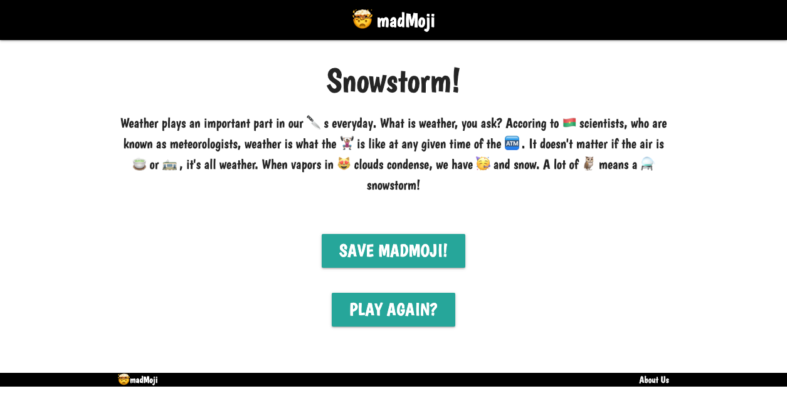

# madMoji
Imagine a website where you could combine two of your favorite things…emojis….and madlibs. Now imagine a website where those two things automatically populated onto a clean user interface due to user prompts that create hilarious madlibs with emojis. Welcome to madMoji. A website designed to make you feel good, to make you laugh, to make silly madlibs with emoji’s.

### User story: 
GIVEN a desire to make a madlib story with emojis
WHEN I come to the website I am presented with a start button to click
THEN I am presented with 5 random emojis to choose from
WHEN I click on the emojis they are populated into a randomly generated madlib
THEN I am presented with the finalized madMoji
WHEN I save my most recent madMoji
THEN I am able to recall my most recent madMoji from local storage

[Link to live website](https://svellucci18.github.io/madMoji/)